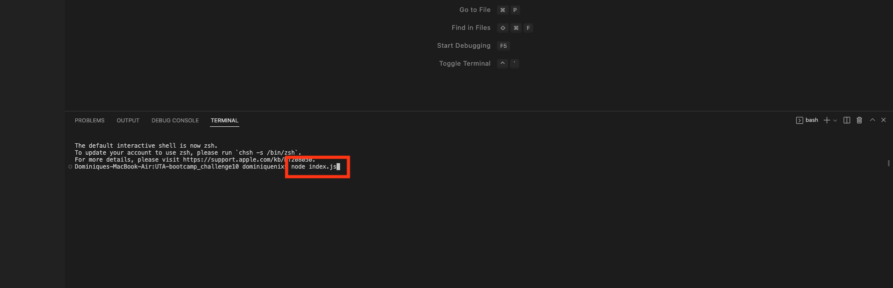

# UTA-bootcamp-challenge10
## Description 
This application is a team profile generator. It uses node and inquirer to prompt the user to answer questions about their team members and generates a web application that creates profiles for each team member they input. This project also uses jest testing to test each js file.
## Table of Contents
- [Installation](#installation)
- [Usage](#usage)
- [License](#license)
## Installation
1. Copy the SSH key from the Repo into a folder on your own computer
2. Once the files are installed, open the folder in your personal workspace
3. For this application you will have to install inquirer and jest in the package.json file
4. Open the intergrated terminal on the index.js file and run node index.js
5. Answer the prompt questions in the terminal. Keep adding team members until you are satisfied with your team.
6. Once you select the 'Finish Building my team' option, open the dist folder and an updated index.html file should be availble to open in your borwser and view your team profiles.
## Usage

## License
This project uses an MIT license. For more information click the license badge at the top of the README.